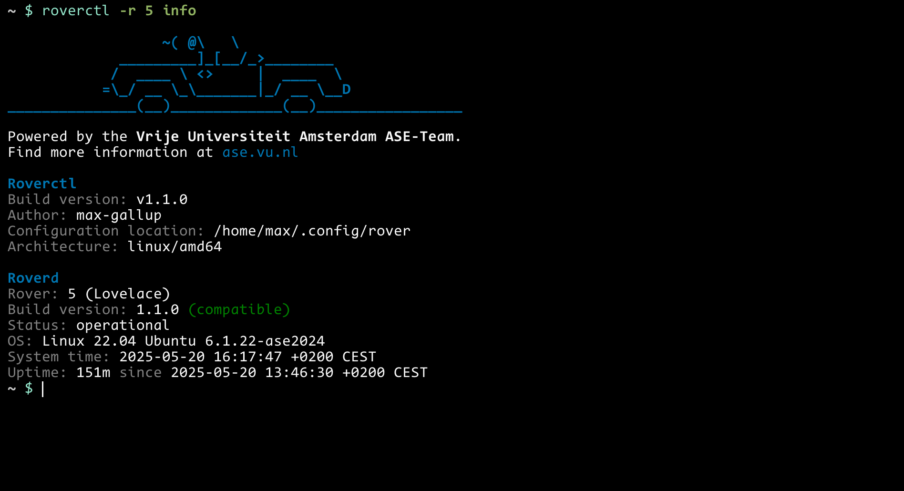
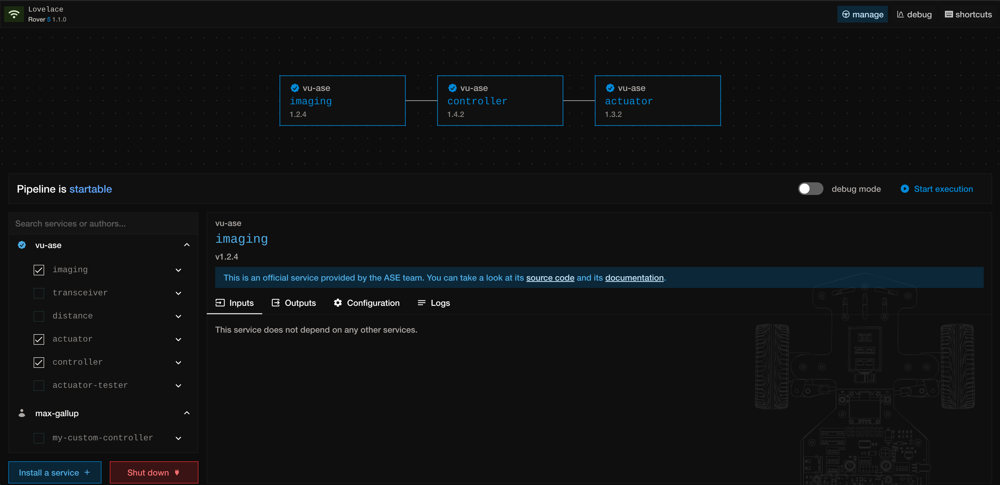
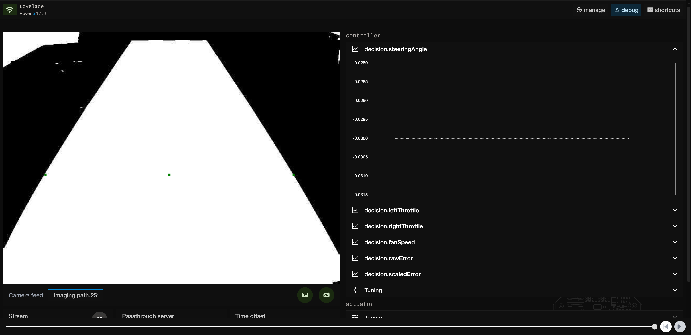

+++
title = "The ASE Rover: an Educational Platform for Embedded Systems"
description = "Autonomous Systems Engineering (ASE) is a Lab providing small-scale autonomous vehicles for students of Computer Science at Vrije Universiteit Amsterdam."
date = 2024-05-05
draft = false
[extra]
image = "ase-logo.png"
repo = "https://github.com/VU-ASE"
docs = "https://ase.vu.nl"
+++

The main goal of this project was to create small-scale autonomous vehicles that use computer vision for real-time autonomous driving. Such vehicles would be used in the annual [NXP Cup](https://nxpcup.nxp.com/) which is an autonomous driving competition where students from the EMEA region build, program and race autonomous vehicles. Since 2019, the student teams from the VU have been going to the races and in 2023 this project set out to create a fleet of 20 "Rovers". On top of racing, students have the option to do their bachelor thesis at the ASE Lab ranging from topics like computer vision, localization or energy efficient computing. The Rovers were thus designed with two main goals in mind: *performance* and *extensibility*.


## Hardware Design

In order to create a fast vehicle, we decided to prioritize high acceleration and active braking. The drive train consisted of two brushless motors that were mounted in a direct drive configuration. This gave us the advantage of reducing mechanical complexity (no gears needed), however it shifted the complexity to the firmware in the speed controllers. Brushless motors (like those used in drones) use a rather simple, open loop control method and typically run at relatively high RPM. However, our motors need to spin much slower and with more torque due to the direct drive setup. To achieve this, we used the [*Field Oriented Control*](https://en.wikipedia.org/wiki/Vector_control_(motor)) method which requires a sensor to measure the angle of the rotating wheel. Such a closed-loop system then receives a single target speed which it tries to maintain. Setting the target speed to *0* effectively creates a strong braking force and the motors will actively resist rotation, ideal for racing.

Furthermore, since the Rovers are used by students the high power electronics must be protected with fuses and fail safes. Separating the electronics into a power distribution board and a sensor connection board helped mitigate any damages caused by accidents. The sensor connection board offers numerous commonly used hardware interfaces allowing new sensors to be custom mounted. For example, one student project added connected a LiDAR over USB while another project used an accurate current sensor over I2C. As seen in the image below, the Rover was designed to be accessed primarily from the top half (above the blue line) which provides access to all of the electronic connections. On the bottom side of the line are the components that are less interesting for students, namely the aforementioned drive train and battery compartment.


At the heart of the Rover is the [Debix Model A](https://www.debix.io/hardware/model-a.html), a powerful single board computer running Linux. It features various I/O interconnects and comes with Wifi and Bluetooth to enable wireless data transfers.


<br>
<br>

## Software Overview

When we first started programming a prototype Rover in 2022 there were a number of programs we wrote for ourselves that had nothing to do with the racing algorithm. We actually spent most of our time in making tools for ourselves that helped us debug and introspect the Rover. Since the Rover features a rather powerful processor, we decided to build a Web Interface that receives live data from the Rover. This allowed us to see the images from the camera and to plot the values from the sensors live, while the Rover was driving autonomously (more on that later). Furthermore, we wanted to make it easy to manage complex configurations and monitor the status of the Rover so we wrote a lightweight manager that constantly runs on the Rover. Lastly, we wrote a command line utility that gives us full control over the Rover, taking inspiration from command lines tools such as "kubectl". The following is a simplified bird's eye view of the software framework:


From the diagram on the left, we can see modular programs put together to form a basic self driving "pipeline". This design enforces a separation of concerns across multiple programs (referred to as _services_) which exchange data with one another. This modularization allows students to just use parts of the framework that they need and add their own functionality as needed. For example, the default pipeline consists of three services: imaging, controller and actuator. The imaging service is responsible for processing the frames coming out of the camera and from them it extracts the midpoint of the racing track. Then, the controller uses this middle point to calculate the speed and steering angle using PID control. It derives speed and steering commands that are passed on to the actuator, which translates those commands into hardware signals that are sent to the underlying actuators. As we can see, there is a dependency between services where the one depends on values computed by the other. Meanwhile, the transceiver service is one that listens to all data published by any service and reports it live over the network to the developer.

<center>
  <i>But this seems like an unnecessary amount of inter-process communication, why not write just one program?</i>
</center>

While it's true that the modularization adds roughly 1-2ms of overhead to the entire pipeline, it is a worthy tradeoff for the following reason: with this fine grained modularity, students are able to replace any one of these services and don't have to spend time implementing parts of the system that add no value to their research. They simply don't need to reinvent the wheel if that's not part of their project. For example, if a student wants to write their own image processing and navigation algorithm, they can simply pass data to the existing actuator service which commands the underlying hardware to control the motors and steering. Furthermore, the services communicate in a language agnostic protocol meaning that students can implement their service in any programming language.

### Language Agnostic Interop

In order to make the framework language agnostic, separate processes have to exchange messages with as little latency as possible. Shared memory is some basic infrastructure provided by the operating system which does exactly that: share memory between processes. [LibZMQ](https://zeromq.org/get-started/) is a library that exposes handy wrappers on top of shared memory and exposes useful primitives such as **message queues** and **publish-subscribe** models. Luckily, ZMQ offers excellent language support, meaning that a program written in any language could use its ZMQ library to communicate with the rest of the system. However, since most students will either be programming in C, Go or Python, we offer wrappers around ZMQ to make it **even** easier to write a service in those languages. At the core of supporting any language is the flexibility gained by using a message passing implementation such as ZMQ.

### Managing Services

After deciding on the service-oriented architecture, we desperately needed a way of starting and stopping these services and we wanted to create an easy way to hook into the system by giving names to the inputs and outputs of each service. We also did not want to open numerous terminals just to run a `./start` command from each of them, so it had to be done with a single management tool. To tackle this problem, we decided to create a convention that organizes the metadata of a single service into a file called the `service.yaml`. With this information we will be able to manage the service much easier, that is starting, stopping and viewing the logs of each service. This `service.yaml` sits at the root of each directory containing the source code of that service and contains roughly the following information:

``` yaml
name: controller
author: vu-ase
version: 1.0.0

commands:
  run: ./bin/controller
  build: make build

inputs:
  - service: imaging
    streams:
      - path

outputs:
  - decision

configuration:
  - name: speed
    tunable: true
    type: number
    value: 0.4
    mutable: true
  ...
```

We wanted it to make it as **easy** as possible for students to start writing their own service, so let's take a look at each of these fields to understand how the underlying software is helping out manage the complexity.

* `name` - A short name that uniquely identifies a service when running a pipeline (there is always only one "controller" running at a time).
* `author` - Since the Rovers are a shared resource for students, it was important to further identify a service by its author.
* `version` - This further distinguishes a service which is useful for racing. At the day of the competition, one might have multiple versions of the same code which makes it convenient to identify them as different.
* `commands`
    * `run` - Since we want to be able to remotely start the execution, the system needs to know which command to use to actually run the service. In the case of python scripts, this could be something like `run: python main.py`
    * `build` - In case the service needs to be compiled before running, this command will be executed.
* `inputs` - Inputs specify any optional data dependencies from other services. In this case we are subscribing to the "path" output stream of the "imaging" service.
* `outputs` - Outputs specify data streams that this service is publishing. Other service can the read the data by specifying the name of the output stream as one of their inputs.
* `configuration` - This section specifies data that is made available to the program just for convenience. It is often useful to separate data from code, especially if the data is often changed. One nice thing here is the `mutable` field, which allows you to change this configuration value while the Rover is running through the Web interface.


Each service must specify such a `service.yaml` and multiple services together form a pipeline. Using the **roverctl** or via the web interface, one can specify the list of service that should make up a pipeline and start them. An essential part of this design is that if a service B depends on the output from service A, then service A must be listed in the pipeline. Otherwise, service B would not be receiving its input data. When the pipeline is set **roverd** can check that all dependencies are met statically and thus reject the request if there is a service missing. Helpful error messages that explain why a pipeline can't run was crucial in scaling the system to be used by many students. By making the code more self-documenting, for example with helpful error messages reduced the amount that students needed to learn about, they could simply go and try things out and when things wouldn't work out, _usually_ they could quickly figure out why.


### Using the Rover

_Huge shout out goes [**Elias Groot**](https://ljz.nl) for the many hours and iterations put into making the **roverctl** as user friendly as possible!_

After turning on the Rover, the first thing a user must do to start working with it is to install the command line tool. But how exactly do they use it?

First, the user can query the basic information of the Rover to make sure all systems are ready. Each rover is identified with a number, in this case we query Rover #5:



Then the following command `roverctl -r 5 -d`  will open a local webpage that exposes two panels. The first is for managing, here users can see all services on the Rover and which ones are currently enable to make a pipeline:



This gives the students a clear visualization that services can be connected via data-dependencies (i.e. controller depends on imaging). On the left we can see a list of service currently installed on the Rover. There are some default under the "vu-ase" author that we offer for students to get started playing around with it. Students can use the `roverctl -r 5 upload .` command to upload their service to the Rover, like I did with "my-custom-controller". If the pipeline is started with the debug switch turned on, then we also have access to the next panel which shows the live feed of all outputs that our services are publishing.



On the right we can see graphs that plot numeric values as well as a live video feed viewer from the camera on the left. Towards the bottom there is also an option to pause the entire stream and flip back through frames from the last 10 seconds. This feature proved to be extremely useful when debugging why the Rover steered off the track at high speeds.


### The Complete Open Source ASE Framework

#### Rover Managment
* {{ lang(go=true) }} [roverctl](https://github.com/VU-ASE/rover/tree/main/roverctl) - Students download this CLI and use it from their laptops to upload their own services, start/stop pipelines and view logs. It also starts a live view that can be opened from the browser to see a live stream of sensor data.
* {{ lang(rust=true) }} [roverd](https://github.com/VU-ASE/rover/tree/main/roverd) - This is a long-running program that exposes a an API for which to remotely manage the rover with. If **roverctl** is the client, then **roverd** is the server.


#### Services for Self Driving
* {{ lang(go=true) }} [imaging](https://github.com/vu-ase/imaging) - Captures images from the camera and performs binarization and morphological operations to get a black and white representation of the racing track. Then, a custom algorithm computes the desired middle of the track and publishes this information to other services.
* {{ lang(go=true) }} [controller](https://github.com/vu-ase/controller) - As the name suggests, it makes control decisions about the Rover by taking as input the track middle from imaging service and uses a PID Controller to compute the speed and steering values. It publishes these values to other services.
* {{ lang(go=true) }} [actuator](https://github.com/vu-ase/actuator) - Reads the speed and steering values from the controller service and sends actuation commands over an I2C device to control the hardware.

#### Extra Services
* {{ lang(go=true) }} [transceiver](https://github.com/vu-ase/transceiver) - A special service that listens to all services that publish any data and sends this data to the connected web client over Wifi. Because of **roverd** this service simply works out of the box and requires no configuration to listen on any outputs of other services.
* {{ lang(go=true) }} [distance](https://github.com/vu-ase/distance) - The Rovers come equipped with forward facing sensors that measure the distance to roughly any object in front of the rover. This service simply publishes the distance data.
* {{ lang(go=true) }} [energy](https://github.com/vu-ase/energy) - When equipped with an INA-266 current sensor, this service publishes voltage, current and power data.
* {{ lang(cpp=true) }} [lidar](https://github.com/vu-ase/lidar) - When equipped with an SLAMTEC RPLIDAR A2M8 Lidar this service publishes the data exported by this lidar in real time.
* {{ lang(go=true) }} [remote-control](https://github.com/vu-ase/remote-control) - Manually control the rover over bluetooth with PlayStation-5 controller.


#### Safety Daemons
The following might look like services, however they are special ones that are hidden away from the users that are always running in the background (hence daemons). They are managed by **roverd** and the rover will not start unless they are running.
* {{ lang(go=true) }} [battery](https://github.com/vu-ase/battery) - The rovers are equipped with Lithium Polymer batteries which can be severely damaged when fully depleted. Since we did not want make students responsible the battery, this service constantly monitors the voltage and performs a system shutdown the battery is drained to a safe threshold.
* {{ lang(go=true) }} [display](https://github.com/vu-ase/display) - Displays the battery capacity as well as other statistics on the screen at the front of the rover.

#### Templates
These are example services that show case a key feature of the Rover: driving donuts! Each of these services pretends to be a controller which means it has code that reads data from imaging and sends commands the actuator that make the Rover drive in a circle endlessly. While it is a simple function, it provides a useful start for students to understand how to integrate their project on to the Rover.
* {{ lang(go=true) }} [service-template-go](https://github.com/vu-ase/service-template-go)
* {{ lang(python=true) }} [service-template-python](https://github.com/vu-ase/service-template-python)
* {{ lang(c=true) }} [service-template-c](https://github.com/vu-ase/service-template-c)
* {{ lang(cpp=true) }} [service-template-cpp](https://github.com/vu-ase/service-template-cpp)

#### Libraries
Each service has to do some amount of work to be connected to the other services. Things like parsing of the service file as well as establishing channels over shared memory. Since this is rather tedious to have to write for every new service we decided to offer libraries that abstract this nicely and make writing a service as easy as possible. While these libraries are used by the services shown above. Students have used them to write their own custom services. 

* {{ lang(go=true) }} [roverlib-go](https://github.com/vu-ase/roverlib-go)
* {{ lang(python=true) }} [roverlib-python](https://github.com/vu-ase/roverlib-python)
* {{ lang(c=true) }} [roverlib-c](https://github.com/vu-ase/roverlib-c)


